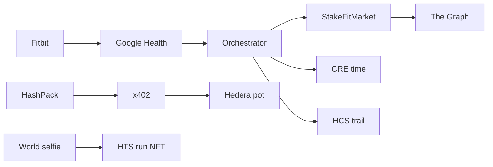

<p align="center">
  
</p>

<h1 align="center">StakeFit</h1>

<p align="center">Daily Fitbit distance races. Enter in HBAR. Fastest pace takes the pot.</p>

You pick a distance and pay to enter. We score a session you already logged and hide other times until the day closes. Top three split the pot 50 / 30 / 20.

Live at [stakefit-ethglobal.vercel.app](https://stakefit-ethglobal.vercel.app).

## How a race works

1. Sign in with Google so we can read Fitbit.
2. Pay the entry from HashPack.
3. Cover the race distance today.
4. After resolve: selfie, claim HBAR, mint a run card.

Score is pace over the catalog distance, not the full session.

## Architecture



| Piece | Role |
| --- | --- |
| Hedera | x402 entry, HCS trail, HTS run card, HBAR payouts |
| Sepolia | Race ledger |
| Chainlink CRE | Score leaves as time only |
| World | Live person before claim or mint |
| The Graph | Indexed view of the ledger |

## Local

```bash
cp .env.example .env
pnpm install
pnpm dev:orchestrator
pnpm dev:web
```

MIT
